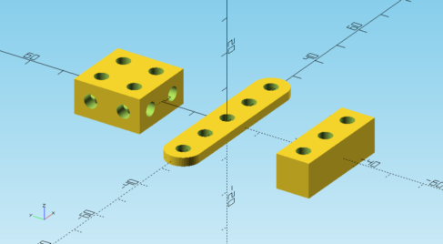
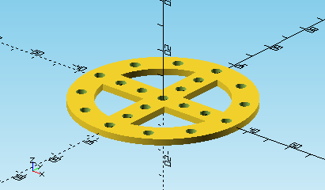

# STEMFIE-X

 
 
### An open source platform for creative people based on STEMFIE and openSCAD 

The STEMFIE-X library is an extension of the [STEMFIE](https://www.stemfie.org/) project, it uses its basic principles with modifications for use as a platform for creating more complex structures and models using mechanical and electronic elements - motors, servos, electronic circuits and control by microcontrollers. The building kit is primarily intended for polytechnic teaching at secondary schools and the first semesters of universities in the teaching of parametric modeling, CAD systems, constructions of machines and mechanisms.

The purpose of the construction library development was to support polytechnic education for secondary schools, to support creative thinking, to acquire basic skills in the design and construction of own devices from sketch, design in CAD program to physical realization using 3D printing.

Areas of use:

- an intermediate level in teaching between constructions from construction kits and independent construction in professional CAD systems, with direct physical output of 3D printing of self-constructed devices and systems, primarily intended for the age category of high school students
- robotics, robotic parts and components, arms, manipulators, robotic chassis
- models of machines and equipment
- models and teaching aids for subjects focusing on the construction of machine parts
- teaching and demonstration aids for physics, electronics, sets of experiments, sets for demonstrations of electric motors, kits for sample electric circuits
- functional mechatronic and electromechanical units – simple plotter, irrigation system, small CNC milling machine ...

### [Installation](https://github.com/pfabo/STEMFIE-X/wiki) 
### [Documentation](./doc-en/0001_obsah.ipynb) (jupyter notebook) 
### [Library source code](./lib/)  (openSCAD)
### [Examples & Demos](./src/)

 
 
### Basic building blocks
```
// source code
BU_Ty(3) beam_block([2,2,1]);
BU_Tx(-2) brace(5);
BU_Ty(-3) beam_block([3,1,1], holes=[false, false, true]);
```

 

### Simple gearbox
```
color("red")  BU_Tz(1+1/8) brace(3);
color("red")  BU_Tz( -1/8) brace(3);

// double gear 
spur_gear (modul=1, tooth_number=28, width=5, bore=4, optimized=false); 
BU_Tz(1/2)  spur_gear (modul=1, tooth_number=12, width=BU/2, bore=4, optimized=false);

// simple gear
color("green") BU_Tz(1/2) BU_Tx(2) Rz(6)      
spur_gear (modul=1, tooth_number=28, width=BU/2, bore=4,  optimized=false);      
 
// axes 
TKx(2*BU) color("blue") BU_Tz(1/2) Cy(2, 20); 
```
 

### Update 231106

Unification of the "center" parameter and thickness centering for implicitly generated components.

```
brace_arc(3, 360, holes = 12);
brace_cross([3,3,3,3]);
```
 
     
 
